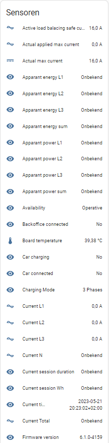

# Alfen Modbus for Home Assistant

Home Assistant integration for **Alfen Eve NG9xx** and **AHP** series EV chargers via Modbus TCP.

## Features

- 🔌 **Real-time monitoring** - Voltage, current, power, energy for all phases
- 🚗 **Car status detection** - Connected, charging, disconnected states
- ⚡ **Load balancing control** - Set maximum charging current dynamically
- �️ **Max current protection** - Prevents setting current above station limit
- �📊 **Session tracking** - Energy consumed and duration per charging session
- 🔄 **Auto-renew max current** - Prevents timeout to safe current mode
- 🏢 **Multi-socket support** - Works with dual socket chargers
- 🌐 **SCN support** - Smart Charging Network (partial)

## Requirements

- Home Assistant **2024.4.0** or newer
- A supported Alfen charger (see [Supported Platforms](#supported-platforms)) with:
  - The minimum firmware version for your platform
  - **Active Load Balancing** license enabled
- Modbus TCP enabled on the charger

## Supported Platforms

| Platform | Minimum firmware | Notes |
|----------|-------------------|-------|
| Eve NG9xx | **4.2.0** (adds Modbus TCP support); **6.4.0+** recommended | Fixes a power budget reset bug — see Known Issues |
| AHP (e.g. AHP02-60227) | **2.6.0** ([release notes](https://knowledge.alfen.com/categories/CAT-01021/KA-01635)) — currently the latest AHP firmware | Requires integration **v0.2.1+**; earlier versions fail every poll cycle because AHP rejects Modbus reads that don't align to register value boundaries ([#40](https://github.com/ThaStealth/alfen_modbus/issues/40)) |

## Installation

### HACS (Recommended)

1. Open HACS in Home Assistant
2. Search for "Alfen Modbus"
3. Click Install
4. Restart Home Assistant

### Manual

1. Copy `custom_components/alfen_modbus` to your `config/custom_components/` folder
2. Restart Home Assistant

## Configuration

1. Go to **Settings** → **Devices & Services**
2. Click **Add Integration**
3. Search for **Alfen Modbus**
4. Enter your charger's IP address and port (default: 502)

## Enabling Modbus on Alfen Charger

1. Acquire the **Active Load Balancing** license from Alfen
2. Enable **Active Load Balancing** via the Alfen Service Installer app
3. Set **Data Source** to "Energy Management System" for slave mode

See the [Alfen Smart Charging Manual](https://knowledge.alfen.com/space/IN/639762449) for details.

## Sensors

| Category | Sensors |
|----------|---------|
| **Device** | Name, Manufacturer, Serial, Firmware, Platform |
| **Station** | Max Current, Temperature, Backoffice Connection |
| **Socket** | Voltages (L1-N, L2-N, L3-N, L1-L2, L2-L3, L3-L1) |
| | Currents (L1, L2, L3, N, Sum) |
| | Power (Real, Apparent, Reactive per phase + Sum) |
| | Energy (Delivered, Consumed per phase + Sum) |
| | Mode 3 State, Availability, Charging Phases |
| **Derived** | Car Connected, Car Charging, Session Wh, Session Duration |

## Controls

| Control | Description |
|---------|-------------|
| **Max Current** | Set the maximum charging current (load balancing) |
| **Phase Mode** | Select 1-phase or 3-phase charging |

## Known Issues

- Power budget may reset to 0A when no car is connected (fixed in NG9xx firmware [6.4.0-4210](https://knowledge.alfen.com/space/IN/243466257))
- **Reallin power meter (post-2021)**: Chargers with a Reallin power meter produced after 2021 only export a subset of measurement values. Per-phase energy, apparent energy, and reactive energy sensors will show as "unavailable" (NaN). This is a hardware limitation, not a bug.
- **AHP platform, integration < v0.2.1**: all entities stay unavailable because a single oversized Modbus read fails on every poll cycle. Update to v0.2.1 or newer ([#40](https://github.com/ThaStealth/alfen_modbus/issues/40)).

## Contributing

Contributions are welcome! Please feel free to submit a Pull Request.

## License

This project is licensed under the Apache 2.0 License - see the [LICENSE](LICENSE) file for details.
